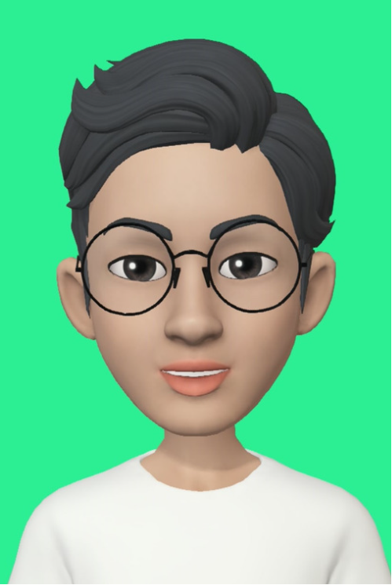
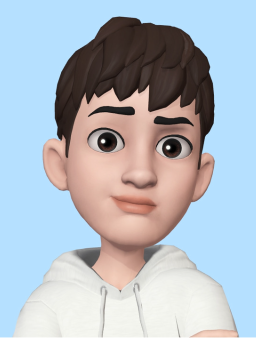

# Team : 974981

## Project 💡
문맥적 유사도 측정(STS:Semantic textual similarity)
- STS데이터셋을 활용하여 두 문장의 유사도를 측정하는 AI모델을 설계

## Members ✨
<!-- ALL-CONTRIBUTORS-LIST:START - Do not remove or modify this section -->
<!-- prettier-ignore-start -->
<!-- markdownlint-disable -->
<table>
  <tr>
    <td align="center"><a href="https://github.com/Broco98"> <b>김효연</b>
    <td align="center"><a href="https://github.com/a-Tachyon"> <b>서유현</b>
    <td align="center"><a href="https://github.com/MuHyeonSon"> <b>손무현</b>
    <td align="center"><a href="https://github.com/MonteCarlolee"> <b>이승진</b>
    <td align="center"><a href="https://github.com/Jiwonii97"> <b>황지원</b>
  </tr>
</table>
      👉 이름을 클릭하시면 해당 멤버의 <code>Github 페이지</code>로 넘어갑니다
